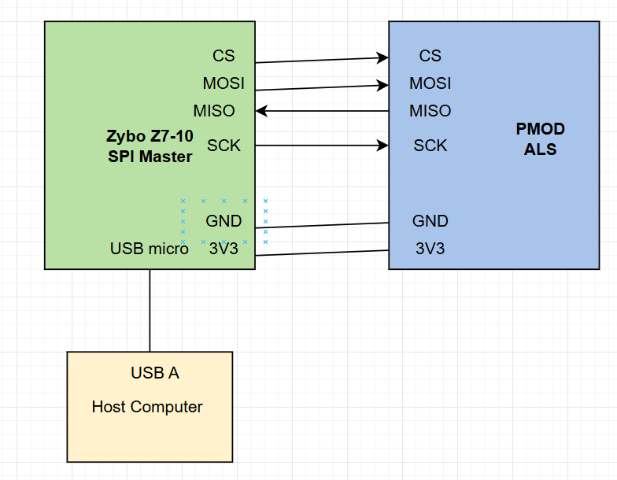
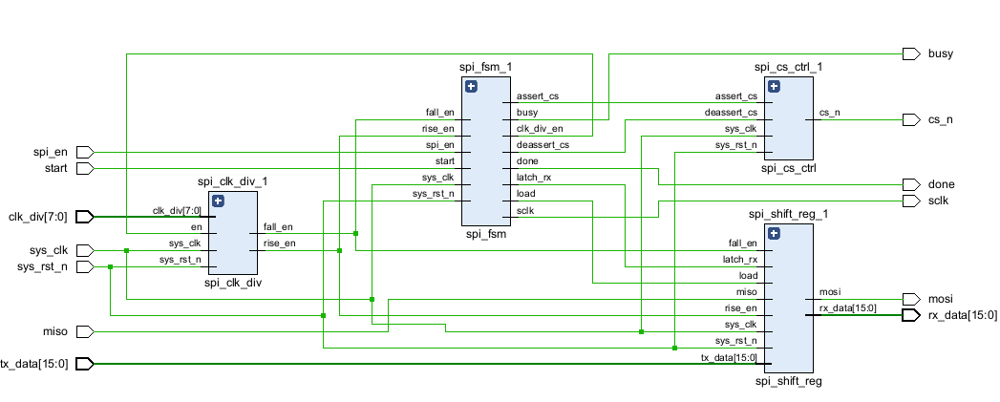
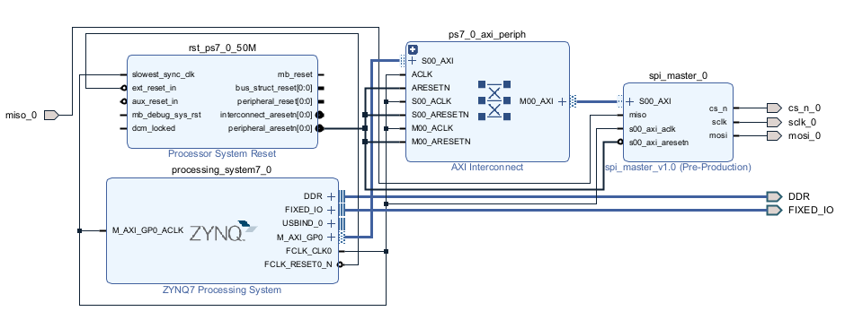
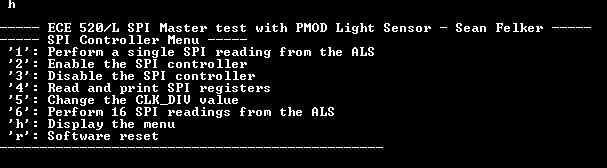
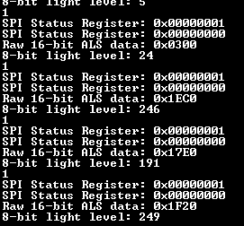

# ECE 520/L Lab 6: SPI Sensor SoC Integration
**CSU Northridge**

**Department of Electrical and Computer Engineering**

## Introduction
In this lab project, a Serial Peripheral Interface (SPI) master hardware module is implemented in
Verilog. Its functionality is verified before it is packaged as a custom AXI-Lite peripheral IP
block in Vivado. The IP block is connected to the Zynq Processing System (PS) using an AXI
interconnect. The SPI connections are routed out to the PMOD pins of the Zybo Z7-10
ARM/FPGA SoC Development Board to connect with a PMOD Ambient Light Sensor (ALS).
The hardware platform developed in Vivado is exported to the Vitis IDE and a C program is
written to configure and control the SPI master IP block by interacting with its memory-mapped
registers. The software does this to read the light sensor data from the PMOD ALS and print it
out to the serial terminal on the host computer.

## Components and Applications Used
- Zybo Z7-10 ARM & FPGA SoC Developement Board
- PMOD Ambient Light Sensor (ALS)
- USB-A to micro USB cable
- Vivado 2023.2
- Vitis IDE 2023.2
- VS Code

## System Architecture
- Programmable Logic (Verilog): SPI master HDL module packaged as a custom AXI-Lite peripheral IP block. Used to to enable communication between the Zybo Z7-10 and the light sensor. 
- Processing System (C): Interactive menu that allows the user to control when light sensor readings are taken. Sensor readings are reported in the serial terminal of the host computer.

## Programmable Logic (PL): SPI Master Module

Four HDL components are designed and connected to create the SPI master HDL module. A testbench was written to verify the functionality of each submodule before testing the full SPI master top level module.

- **SPI Clock Divider** (spi_clk_div.v): Given a clock divider value as an input, the module produces two pulse signals, ‘fall_en’ and ‘rise_en’, each respectively signaling a rising and falling edge of the SCLK. Clock divider values are used to get an SCLK frequencies between 1 MHz and 4 MHz that work with the PMOD ALS.
- **SPI Shift Register** (spi_shift_reg.v): Handles the serial data processing for the SPI module. On each SCLK falling edge, it shifts a bit of data to be sent out to the MOSI signal one bit at a time, MSB first. On each SCLK rising edge, it samples a bit from the MISO line and stores it into the receive shift register. When the transfer completes (16 bits), the recieve register is latched.
- **SPI Chip-Select (CS) Control Module** (spi_cs_ctrl.v): Controls the CS signal of the SPI module. Upon receiving an assertion signal, sets the CS output signal to its active low state until a deactivate signal is receievd, at which point the CS signal will be driven high.
- **SPI Finite State Machine** (spi_fsm.v): Sequences the entire module through a full SPI transfer by driving control signals to the other three modules. Operates through three states (idle, transfer, and done) to start a SPI transfer, send data, and latch received data.
- **SPI Master Top Level** (spi_master.v): Top level module that wires all internal signals of the submodules to build the full SPI master.

After verifying the funcitonality of the SPI module, it is packaged into a custom AXI-Lite IP block using tools provided by Vivado. Memory-mapped registers are configured to allow the SPI module to be integrated with the Zynq Processing System (PS). A testbench is written to verify that the SPI module can be fully controleld through writing to and reading from these memory-mapped registers using AXI-Lite.
| Register Name | Offset | Field         | Bits    | Access | Reset Value | Description |
|--------------|--------|----------------|---------|--------|-------------|-------------|
| FPGA_REV     | 0x00   | FPGA_REV_VALUE | [31:0]  | RO     | 0x5200_0006 | FPGA revision value |
| SW_RST       | 0x04   | RSVD           | [31:1]  | RO     | 0x0000_0000 | Reserved bits |
| SW_RST       | 0x04   | SW_RST         | [0]     | W1C    | 0           | Software-controlled reset. Self-clears after 1 clock cycle. |
| SPI_CTRL     | 0x08   | RSVD           | [31:2]  | RO     | 0x0000_0000 | Reserved bits |
| SPI_CTRL     | 0x08   | SPI_EN         | [1]     | RW     | 0           | SPI Controller enable |
| SPI_CTRL     | 0x08   | START          | [0]     | W1C    | 0           | Write 1 to begin a 16-bit SPI transfer. Self clears after 1 clock cycle. |
| SPI_STATUS   | 0x0C   | RSVD           | [31:2]  | RO     | 0x00_0000   | Reserved bits |
| SPI_STATUS   | 0x0C   | DONE           | [1]     | RO     | 0           | Latches high when a SPI transfer has completed. Clears when read by software. |
| SPI_STATUS   | 0x0C   | DONE           | [0]     | RO     | 0           | Reads 1 if the SPI module is in the middle of a transfer. |
| TX_DATA      | 0x10   | RSVD           | [31:16] | RO     | 0x0000      | Reserved bits |
| TX_DATA      | 0x10   | TX_DATA        | [15:0]  | RO     | 0x0000      | Data to be transmitted out on the next SPI transfer through the MOSI bus. |
| RX_DATA      | 0x14   | RSVD           | [31:16] | RO     | 0x0000      | Reserved bits |
| RX_DATA      | 0x14   | RX_DATA        | [15:0]  | RO     | 0x0000      | Stores the last full 16-bit data received from the MISO bus. |
| CLK_DIV      | 0x18   | RSVD           | [31:8]  | RO     | 0x00_0000   | Reserved bits |
| CLK_DIV      | 0x18   |   CLK_DIV      | [7:0]  | RW      | 0x00        | Clock divider value to generate the SCLK frequency following the formula freq = sysclk / (2*(CLK_DIV+1))  |

## Processing System (PS)
Software is writting in C programming language using the Vitis IDE to verify that the system can receive light sensor data from the PMOD ALS. The program implements an interactive menu
controlled by the user’s keyboard presses on the serial terminal of the connected host computer.
For example, pressing ‘1’ causes the SPI module to read light sensor data from the ALS and print
it out. Other menu functions include enabling and disabling the SPI module, reading from and
printing all memory-mapped registers, changing the clock divider value, initiating software reset,
and performing 16 consecutive sensor readings and calculating the minimum, maximum, and the
average of the light sensor data. To read the sensor data of the PMOD ALS, the software extracts
bits 12 through 5 from the received 16-bit SPI data frame. The sensor outputs values from 0 to
255, with low values indicating low light level, and higher values indicating high light level.

# Conclusions
- The system works to take light readings from the ALS and print them to the host computer's terminal. Shining a light on the ALS results in higher reading values, while covering the ALS results in lower reading values.
- From this lab project, I learned how SPI communication works in detail by building a SPI master module in Verilog. I learned how to integrate my module into a SoC using AXI interconnect and get successful readings from a real-world sensor.

## Video Demonstration
[Link](https://youtu.be/9UXWTjfaM-k)